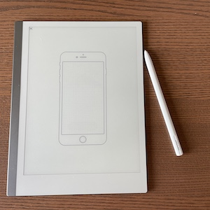

# Mobile phone wireframe for Remarkable tablet

For drawing a mobile app UI on your reMarkable tablet. I was searching for a way to make app-mockups on my reMarkable when I found [Sketchize](https://github.com/selfishprimate/sketchize). I ported their smartphone sketch sheet with dotted grid to a reMarkable template for easy sketching.



_The Sketchize wireframing sheet is licensed under the [SIL OFL 1.1](https://scripts.sil.org/cms/scripts/page.php?site_id=nrsi&id=OFL)_

## How to install

Follow this guide on the [reMarkableWiki](https://remarkablewiki.com/tips/templates): <https://remarkablewiki.com/tips/templates>

Or, in short:

- Copy the `phone.png` and `phone.svg` files (from the **[templates](/tree/main/templates)** folder of this repo) to your reMarkable in the `/usr/share/remarkable/templates/` folder.
- Add this piece of json to your `templates.json` file:

```json
    ,
    {
      "name": "Mobile Phone",
      "filename": "phone",
      "iconCode": "\ue91f",
      "categories": [
        "Creative"
      ]
    }
```

- Reload your reMarkable UI, after modifying templates.json you need to restart xochitl:

```shell
systemctl restart xochitl
```

## Read more

### Sketchize

See [Sketchize](https://github.com/selfishprimate/sketchize)

Sketchize is a free wireframing kit that contains a sets of printable device sketch sheets. It is built for UI/UX Designers to help them design lovely apps for mobile, tablet and desktop devices.

### reMarkable

The [remarkable 2 tablet](https://remarkable.com/) is a paper tablet to replace your notebooks and printed documents with the only tablet that feels like paper.
